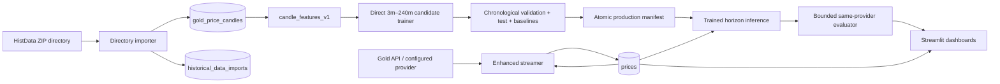

# Gold Price Prediction

## About the project

Gold Price Prediction is a Python application for exploring gold-price history, collecting live XAU/USD quotes, training regression models, and displaying forecasts and prediction performance in a multipage Streamlit dashboard.

The current runtime consists of two application processes:

- `app/main.py`: Streamlit navigation and dashboards.
- `realtime/streamer_enhanced.py`: live provider polling/streaming, snapshot persistence, multi-horizon prediction generation and evaluation, and the background retraining scheduler.

PostgreSQL is the durable datastore. Redis is an optional cache; the application continues with PostgreSQL when Redis is unavailable. There is no separate REST backend, HTTP prediction API, Docker configuration, Node frontend, Java service, or message broker in this repository.

The principal database responsibilities are deliberately separate:

```text
prices
    Irregular live-provider snapshots.

gold_price_candles
    Completed OHLC candles. HistData imports currently provide canonical 1m rows.

historical_data_imports
    Per-ZIP/CSV historical import audit records.
```

The historical importer reads ZIP archives directly from a trusted configured directory. It does not require or create permanent extracted copies. It imports CSV entries, ignores TXT status reports and other files, and stores canonical one-minute candles. Larger buckets are calculated from one-minute rows on demand.

Supported stored/derived timeframes are:

```text
1m (stored)
3m, 5m, 15m, 30m, 1h, 4h (derived)
```

## Architecture



Historical flow:

```text
configured directory → sorted ZIP files → streamed CSV entries
→ batched ON CONFLICT inserts → gold_price_candles
→ historical_data_imports audit
```

Live flow:

```text
configured provider → validated quote → idempotent live_api snapshot in prices
→ prediction lifecycle → dashboard
```

Training reads completed `histdata/XAUUSD/1m` candles from `gold_price_candles`. It does not turn irregular `prices` rows into fake OHLC records. Training and inference share the ordered 18-column `candle_features_v1` implementation. Live inference uses completed candles for features and a separately validated live `prices` quote as its reference price.

Production horizons are elapsed UTC minutes: 3, 5, 15, 30, 60 and 240. Training labels require a candle at exactly `feature_candle_time + horizon`; the next available row after a gap is never substituted.

No live-candle builder is enabled. A single quote cannot establish meaningful open, high, low and close values, and the current schema does not record the observation count needed to grade a live candle’s quality.

## Prerequisites

The tested local stack is:

- macOS/Linux with Bash.
- Python 3.12; verification used Python 3.12.6.
- PostgreSQL reachable through `DATABASE_URL`.
- `curl`, used by the launcher for Streamlit readiness.
- Redis 5-compatible server is optional.

Python packages are installed with `pip` from `requirements.txt`. Streamlit 1.41.1 and Alembic 1.19.1 were used during launcher verification.

There are no Maven, Gradle, npm, Docker or Docker Compose prerequisites.

## Configuration

Copy the safe template and edit the local file:

```bash
cp .env.example .env
```

Never commit real database passwords or provider keys. Important variables include:

| Variable | Required | Purpose |
|---|---:|---|
| `DATABASE_URL` | Yes | SQLAlchemy PostgreSQL URL |
| `DEFAULT_PROVIDER` | Yes | `gold_api`, `metalprice`, or `finnhub` |
| `METALPRICE_API_KEY` | Provider-dependent | Metalprice credential |
| `FINNHUB_API_KEY` | Provider-dependent | Finnhub credential |
| `GOLD_API_CACHE_SECONDS` | No | Gold API cache; enforced minimum is 35 seconds |
| `GOLD_API_POLLING_INTERVAL` | No | Gold API poll interval; default 60 seconds |
| `MAXIMUM_LIVE_PRICE_AGE_SECONDS` | No | Maximum database fallback age; default 180 |
| `LIVE_CLOCK_SKEW_SECONDS` | No | Maximum accepted future provider skew; default 120 |
| `PREDICTION_ACTUAL_TOLERANCE_SECONDS` | No | Maximum delay for a same-provider actual quote; default 90 |
| `PREDICTION_CANDLE_MAX_AGE_SECONDS` | No | Maximum age of the latest feature candle; default 259200 |
| `REDIS_HOST`, `REDIS_PORT`, `REDIS_DB`, `REDIS_PASSWORD` | No | Optional cache connection |
| `MODEL_DIR` | No | Model artifact directory; default `models` |
| `DEFAULT_MODEL` | No | Background trainer model; default `linear_regression` |
| `TRAINING_MAX_CANDLES` | No | Maximum latest candles loaded for one training run; default 250000 |
| `TRAINING_RATIO`, `VALIDATION_RATIO`, `TEST_RATIO` | No | Chronological 70/15/15 split |
| `MINIMUM_TEST_SAMPLES` | No | Minimum untouched test rows per horizon for promotion; default 100 |
| `PROMOTION_REGRESSION_TOLERANCE` | No | Maximum allowed MAE regression against production; default 0.02 |
| `PERFORMANCE_MINIMUM_SAMPLES` | No | Samples required for rankings/retraining decisions; default 50 |
| `MIN_SAMPLES_FOR_RETRAIN` | No | New-candle/outcome trigger; default 50 |
| `RETRAIN_INTERVAL_HOURS` | No | Scheduled trigger interval; default 24 |
| `HISTORICAL_DATA_ALLOWED_IMPORT_ROOT` | For imports | Trusted root containing import directories |
| `HISTORICAL_DATA_IMPORT_DIRECTORY` | For imports | Configured ZIP directory under the trusted root |
| `HISTORICAL_DATA_BATCH_SIZE` | No | Import batch size; default 10000 |
| `STREAMLIT_PORT` | No | Launcher-only dashboard port; default 8501 |

See [.env.example](.env.example) for archive size, compression-ratio and entry-count safety limits.

This repository has no container configuration. Historical paths are therefore host paths. If the application is placed in a container by downstream deployment tooling, mount the host dataset read-only and set both historical path variables to paths visible inside that container. For example:

```text
host:      /data/xauusd
container: /historical-data/xauusd (read-only mount)
```

## How to run the project

Create and populate the virtual environment first:

```bash
python3 -m venv .venv
source .venv/bin/activate
python -m pip install -r requirements.txt
```

Ensure PostgreSQL identified by `DATABASE_URL` is running, then use the root launcher:

```bash
./start-all.sh
```

The launcher:

1. Resolves paths relative to itself.
2. Validates Python 3.12, required packages, `.env`, `curl`, PostgreSQL and optional Redis.
3. Runs `alembic upgrade head` without resetting data.
4. Starts the enhanced live streamer.
5. Starts Streamlit at `http://localhost:8501` by default.
6. Checks `/_stcore/health` before reporting success.
7. Writes process logs under `logs/launcher/` and PID files under `.run/`.
8. Stops locally launched child processes on Ctrl+C, SIGINT or SIGTERM.

Normal startup does not import historical archives or explicitly train a model. Supported explicit operations are:

```bash
./start-all.sh --help
./start-all.sh --import-history
./start-all.sh --train
./start-all.sh --retrain
```

`--train` performs initial candidate training and refuses to replace an existing approved production bundle. `--retrain` requires an existing production bundle, compares the candidate with persistence and production, and promotes only when every acceptance check passes. A failed or rejected candidate leaves production unchanged. These operations run before application processes start.

Service information:

```text
Dashboard:        http://localhost:8501
Dashboard health:http://localhost:8501/_stcore/health
PostgreSQL:       host/port from DATABASE_URL (normally localhost:5432)
Redis:            optional, normally localhost:6379
```

There is no backend API URL or Swagger/OpenAPI page.

Logs:

```bash
tail -f logs/launcher/streamer.log
tail -f logs/launcher/dashboard.log
```

To use another dashboard port:

```bash
STREAMLIT_PORT=8502 ./start-all.sh
```

If the requested port is occupied by a healthy Streamlit instance, the launcher reuses it. Otherwise it fails clearly rather than killing an unrelated process.

### Manual developer startup

These are the same actual components started by the launcher:

```bash
source .venv/bin/activate
alembic upgrade head
python realtime/streamer_enhanced.py
```

In another terminal:

```bash
source .venv/bin/activate
streamlit run app/main.py --server.port 8501
```

Redis may be started with the operating system’s service manager, but is not mandatory. PostgreSQL is externally managed because the repository contains neither a Compose definition nor a portable database-cluster configuration.

## Database setup

Create the PostgreSQL database and credentials using your organization’s normal administration process, then put the connection URL in `.env`. The launcher does not create users/databases because doing so requires server-specific administrative credentials.

Apply migrations manually with:

```bash
source .venv/bin/activate
alembic upgrade head
alembic current
```

Startup never drops tables, deletes existing rows, resets migration history, imports archives or retrains explicitly.

Useful read-only checks in `psql`:

```sql
SELECT COUNT(*) FROM prices WHERE source = 'live_api';
SELECT COUNT(*) FROM gold_price_candles
WHERE provider = 'histdata' AND symbol = 'XAUUSD' AND timeframe = '1m';
SELECT source_zip, source_csv, status, total_rows, inserted_rows,
       duplicate_rows, invalid_rows, error_message
FROM historical_data_imports
ORDER BY started_at DESC
LIMIT 20;
```

Migrations live in `migrations/versions/`. Live quote idempotency is scoped by the partial unique index on `(provider, raw_symbol, timestamp)` where `source='live_api'`.

## Importing historical data

1. Place HistData ZIP files in `HISTORICAL_DATA_IMPORT_DIRECTORY` beneath `HISTORICAL_DATA_ALLOWED_IMPORT_ROOT`.
2. Do not unzip them.
3. Ensure the application user can read the directory and archives.
4. Run:

   ```bash
   ./start-all.sh --import-history
   ```

   To run only the importer after migrations:

   ```bash
   source .venv/bin/activate
   alembic upgrade head
   python import_historical_data.py
   ```

5. Inspect `historical_data_imports` for per-file results.
6. Confirm rows in `gold_price_candles`, not `prices`.

Expected CSV rows are:

```text
Date, Time, Open, High, Low, Close, Volume
2026.08.02,18:00,4081.935,4081.935,4069.685,4073.295,0
```

HistData timestamps are parsed with a fixed UTC−05:00 offset without daylight-saving adjustment and converted to UTC. Spot-gold volume is often unavailable; zero is stored as `NULL`.

The importer streams batches, ignores TXT files, audits each CSV, and uses `ON CONFLICT` against `(provider, symbol, timeframe, candle_time)`. Re-importing the same data is safe: existing candles are counted as duplicates rather than inserted again.

## How the model is trained

The approved trainer is `MultiHorizonTrainer` in `src/model_pipeline.py`. `src/realtime_trainer.py` is now only a compatibility facade and never loads the legacy 128-feature artifacts.

Initial training is explicit:

```bash
./start-all.sh --train
```

Or run only the explicit training command:

```bash
source .venv/bin/activate
python train_models.py --mode train --algorithm linear_regression
```

Implemented models are linear regression, random forest and XGBoost. The configured default is linear regression.

Training specification:

- Table/filter: `gold_price_candles`, `provider='histdata'`, `symbol='XAUUSD'`, `timeframe='1m'`.
- Input OHLC: `open_price`, `high_price`, `low_price`, `close_price`.
- Features: OHLC, SMA 7/14/30, EMA 7/14, absolute/percentage change, volatility 7/14, RSI 14, and close lags 1/2/3/7.
- Input shape: 18 numeric columns per sample.
- Targets: six direct returns, `(close_at_exact_t_plus_h - close_at_t) / close_at_t`, for 3/5/15/30/60/240 elapsed UTC minutes.
- Gap policy: target candles must exist at the exact timestamp; the 30-candle feature context must be one-minute continuous within one session.
- Split: chronological 70% training, 15% validation and final untouched 15% test, with a 240-minute purge around boundaries.
- Scaling: each scaler is fitted only on its horizon's training partition.
- Metrics per split/horizon: MAE, RMSE, sMAPE, informational R², directional accuracy, persistence/zero-return baselines, most-common-direction baseline, and improvement over persistence.
- Candidate artifacts: `models/candidates/<version>/`.
- Production pointer/bundle: `models/production/manifest.json` and its colocated checked artifacts.
- Manifest: ordered features, schema and bundle versions, target definition, data/split ranges, hyperparameters, library versions, metrics, baselines and SHA-256 checksums.

The same `src/candle_features.py` implementation constructs training and inference features. `TRAINING_MAX_CANDLES` bounds memory use. A candidate is not production merely because training completes: it must have enough test rows, finite metrics, schema-compatible artifacts, and must not lose to persistence on test MAE for any horizon.

The initial linear-regression candidate trained during the 2026-08-17 verification was correctly rejected because it was slightly worse than persistence. Consequently, no production bundle was activated and the UI correctly reports that no approved trained model is available. This is safer than presenting an unqualified forecast.

The repository also contains `src/train.py` and older daily CSV/model artifacts used by the original forecast dashboard. That legacy pipeline is separate from the approved one-minute candle trainer and should not be used as evidence that irregular `prices` snapshots are candle training data.

## How and when to retrain

Explicit retraining is:

```bash
./start-all.sh --retrain
```

The enhanced streamer also runs `BackgroundTrainingScheduler`. Its watermarks and last successful training time are stored in `training_scheduler_state`. Triggers use elapsed schedule, new completed candles, manual requests, or sufficiently sampled baseline-relative/directional degradation. The legacy `100-error%` score is never a retraining trigger. A PostgreSQL advisory lock prevents multiple training/promotion jobs across processes.

Retraining is appropriate after meaningful new completed candles, degraded measured accuracy, a distribution shift, feature/horizon changes, cleaning changes, approval of a new provider dataset, or model/hyperparameter changes—not merely because the application restarted.

A safe operational workflow is:

1. Import and validate new candles.
2. Check gaps, duplicate counts and invalid OHLC rows.
3. Preserve the current artifacts.
4. Train a candidate.
5. Evaluate on a chronological holdout.
6. Compare candidate and production metrics.
7. Promote only when acceptance criteria pass.
8. Retain rollback artifacts.
9. Record dataset range, training time, metrics and version.

Candidate training never writes active artifact names. A complete candidate is validated before an atomic production-directory switch. The prior production directory is retained at `models/previous_production/` for rollback. Legacy `*_realtime.pkl` and daily artifacts remain untouched for traceability but cannot be selected by the production manifest.

Promotion uses one complete six-horizon bundle. Every required horizon must pass; partial per-horizon promotion and mixing models from different candidate bundles are not supported. Training outcomes are distinct:

- `PROMOTED`: artifacts and quality criteria passed and the production bundle changed atomically.
- `REJECTED`: training and artifact validation succeeded, but one or more quality gates failed; production is unchanged and structured horizon metrics remain under the candidate path and in `retraining_runs`.
- `FAILED`: an unexpected training, database, filesystem, serialization, or validation failure occurred.

Expected quality rejection is logged as a warning without a traceback. The Self-Learning page displays the candidate path, rejection reason, production-change result, and candidate-versus-persistence MAE/RMSE for each horizon.

## Prediction mechanism

There are three explicitly separated prediction identities:

- `legacy_daily`: the prominently labelled legacy experimental page loads old daily artifacts through `src/predict.py`; it is not the default.
- `adaptive_momentum_baseline`: preserved old `horizon_predictions` rows are classified `LEGACY`; the heuristic is not a production fallback.
- `trained_multi_horizon`: the default live page loads only the validated production manifest and direct horizon artifact.

The live service loads up to 300 completed `histdata/XAUUSD/1m` candles. It refuses prediction when the latest live quote is stale or future-dated, the latest candle is stale, fewer than 30 completed candles exist, recent OHLC is invalid, or the required feature window is discontinuous. It never silently falls back to adaptive momentum.

The latest live snapshot is a separate current-price input. It is never copied into open/high/low/close. Prediction context records the last completed candle time, latest live timestamp, model prediction time, horizon, stale state and missing-period count.

Inference validates bundle version, model version, horizon, `candle_features_v1`, exact feature count/order, sklearn compatibility, scaler shape, and artifact checksums. Without an approved production manifest the page displays: `No approved trained model is currently available. Run initial training and pass promotion checks.`

For evaluation, each pending prediction stores its provider and tolerance. The evaluator selects the earliest matching normalized-symbol, `live_api`, same-provider quote from `target_at` through `target_at + PREDICTION_ACTUAL_TOLERANCE_SECONDS`. If none exists after the window closes, status becomes `UNRESOLVABLE`; a later quote is never used. Evaluation uses row locking/conditional status updates and is idempotent.

Performance excludes `LEGACY` by default and reports evaluated, pending, unresolvable and failed counts; MAE, RMSE, percentage error, directional accuracy, persistence MAE and improvement; evaluation delays; and horizon/model-version breakdowns. Rankings and improvement declarations require `PERFORMANCE_MINIMUM_SAMPLES`.

No prediction HTTP endpoint is implemented. Predictions are generated by the streamer and displayed by Streamlit.

## API documentation

This project currently exposes no application REST API, so there are no HTTP paths for live price, imports, candles, training, prediction, readiness or API documentation, and no HTTP authentication layer to document.

The actual external provider call implemented by `GoldApiProvider` is:

```http
GET https://api.gold-api.com/price/XAU/USD
```

It is not a local application endpoint. The client enforces at least 35 seconds between outbound calls.

The only local HTTP readiness URL is Streamlit’s internal health endpoint:

```http
GET /_stcore/health
Authentication: none; launcher binds Streamlit to localhost
Response: ok
```

Administrative operations are local CLI calls (`import_historical_data.py`, `--train`, `--retrain`), not HTTP endpoints.

## Testing

The repository uses Python `unittest`; `pytest` is not installed by `requirements.txt`.

Relevant live/candle integration suite:

```bash
source .venv/bin/activate
python -m unittest -v tests.test_background_lifecycle tests.test_prediction_architecture tests.test_training_outcomes test_gold_api_integration.py test_historical_zip_importer.py
```

Additional provider/project diagnostic tests:

```bash
python -m unittest -v test_metalprice.py
python test_project.py
```

`tests.test_prediction_architecture` and the two integration modules above use isolated SQLite databases and synthetic/local fixtures; they do not call an external provider. The separate diagnostics below may call configured external providers and require network/API keys. There are no frontend JavaScript tests because the frontend is Python Streamlit.

Python syntax and dependency checks:

```bash
python -m compileall -q app config realtime src migrations
python -m pip check
```

## Troubleshooting

- **PostgreSQL unavailable:** start the externally managed server, verify the host/port/database in `DATABASE_URL`, and test `alembic current`.
- **Migration failure:** inspect the Alembic error and database permissions. Do not reset or drop tables as a routine fix.
- **Provider unavailable:** verify `DEFAULT_PROVIDER`, network access and provider-specific keys. `gold_api` requires no configured key.
- **Stale live price:** check `logs/launcher/streamer.log`, provider health and `MAXIMUM_LIVE_PRICE_AGE_SECONDS`. Old data is not presented by `LiveGoldPriceService` as current.
- **Redis unavailable:** this is non-fatal; start Redis for caching or continue with PostgreSQL.
- **Historical directory rejected:** ensure the import directory exists, is readable and resolves beneath the allowed root.
- **ZIP has no CSV:** the archive is audited as skipped. TXT entries are intentionally ignored.
- **Duplicate import:** expected on safe re-import; inspect `duplicate_rows` in `historical_data_imports`.
- **Model artifact missing:** run explicit candle training or verify `MODEL_DIR` and configured model name.
- **Insufficient candles:** import enough continuous 1m history; rolling indicators require at least 30 prior periods plus lag/target availability.
- **Port 8501 occupied:** stop the unrelated process or use `STREAMLIT_PORT=8502 ./start-all.sh`.
- **Dashboard readiness fails:** inspect `logs/launcher/dashboard.log` and call `curl http://localhost:8501/_stcore/health`.
- **Streamer exits during startup:** inspect `logs/launcher/streamer.log`; common causes are PostgreSQL/provider configuration failures.

## Durable background worker and alerts

`realtime/streamer_enhanced.py` is the independent lifecycle worker. Streamlit is read-only UI: page opens, refreshes, navigation and browser closure do not generate, evaluate, notify or train. The worker polls live prices, validates and stores new provider timestamps, generates cadence-controlled predictions from an approved bundle, evaluates pending outcomes on its own timer, updates trust state, delivers queued notifications and evaluates durable retraining triggers. It naturally cannot run while the Mac is powered off.

For local development, `./start-all.sh` starts both worker and dashboard. Its instance check detects a worker already held by `launchd` and does not start a duplicate. The worker also holds an OS file lock at `.run/background-worker.lock`, so races between terminals cannot create duplicate schedulers.

### Install on macOS

The checked-in plist is a secret-free template. Installation resolves this repository and `.venv312` paths into `~/Library/LaunchAgents/com.goldpriceprediction.worker.plist`; secrets remain in `.env`, loaded by the existing settings layer from the configured working directory.

```bash
./scripts/install-background-service.sh
./scripts/status-background-service.sh
./scripts/stop-background-service.sh
./scripts/start-background-service.sh
./scripts/uninstall-background-service.sh
```

Logs are written to `logs/background/worker.stdout.log` and `logs/background/worker.stderr.log`. Inspect launchd state and logs with:

```bash
launchctl print "gui/$(id -u)/com.goldpriceprediction.worker"
tail -f logs/background/worker.stdout.log logs/background/worker.stderr.log
log show --last 10m --predicate 'process == "launchd"'
```

`service_heartbeats` records the actual worker instance, start/heartbeat times, latest quote, prediction, evaluation, training and error. The Background System page reports `STOPPED` after `WORKER_UNHEALTHY_AFTER_SECONDS`; Streamlit health is deliberately not worker health.

### Prediction and evaluation cadence

`PREDICTION_INTERVAL_SECONDS` defaults to 60 and `PREDICTION_EVALUATION_INTERVAL_SECONDS` to 30. A new batch requires a new valid provider quote, fresh/continuous completed candle context, a validated approved bundle and a unique feature-cutoff/live-quote pair. Invalid inputs become a worker diagnostic and do not crash collection. Evaluation independently retains the same-provider, same-symbol, first-quote-at-or-after-target and bounded-tolerance policy. Missing outcomes become `UNRESOLVABLE`; no hours-late quote is substituted.

### Forecast and outcome notifications

Notifications are durable and idempotent in `notification_deliveries` using `(event_type, prediction_id, channel)` uniqueness:

- `FORECAST_READY` means a qualified analytical forecast exists; its outcome is not yet known.
- `OUTCOME_EVALUATED` means the target time passed and the stored prediction was evaluated under the bounded policy. It is performance feedback, not a signal for the expired forecast.

In-app events persist immediately. An optional generic `ALERT_WEBHOOK_URL` receives JSON POST payloads with bounded timeout, retry and exponential backoff. Webhook failure never rolls back predictions or stops the worker. No vendor credentials are hardcoded.

Trust is horizon and model-version specific:

- `PROBATION`: approved offline but lacks the configured live sample count; shown in-app, external forecast webhook suppressed by default.
- `TRUSTED`: offline improvement and rolling live thresholds pass; forecast webhook permitted.
- `DEGRADED`: rolling MAE/directional performance fails; forecast webhook suppressed and retraining review can be triggered.
- `DISABLED`: bundle invalid or offline model does not beat persistence.

Thresholds are configured with the `ALERT_*` variables in `.env.example` and displayed on the Background System page. They do not guarantee correctness or profitability. The project does not place trades or connect to a broker.

### Multi-model candidate benchmark

`DEFAULT_MODEL=benchmark` evaluates installed `linear_regression`, `random_forest` and `xgboost` candidates for each horizon. Algorithm selection uses only the chronological validation split; the untouched test split is used once after selection for promotion confirmation. Each horizon manifest records candidate validation metrics and its selected algorithm. The explicit production bundle remains all-or-nothing: every horizon must pass sample, finite-metric, persistence and production-regression gates before the atomic bundle switch. Rejected candidates and their metrics remain archived.

Market features continue to come exclusively from completed `histdata` `XAUUSD` 1m rows in `gold_price_candles`. Irregular `prices` rows are reference/outcome observations, not OHLC training rows. Prediction outcomes update trust, degradation and retraining decisions only; correctness, prior forecasts and accuracy fields are not included in `candle_features_v1`, preventing a self-referential price-feature loop. Low-observation live candles are not included in training.

## Dashboard experience

The Streamlit application uses one responsive design system, shared read-only query service, global header and global footer. Navigation is organized as:

1. **Overview** — market snapshot, production/trust state, qualified forecasts, aligned model comparison, quality, non-accepted summary, training and system status.
2. **Live Forecasts** — selected-model forecasts, countdowns, data quality, trust and alert decisions.
3. **Prediction Performance** — MAE, RMSE, sMAPE, directional accuracy, persistence comparison and evaluation timing.
4. **Non-Accepted Predictions** — immutable accepted/suppressed/rejected alert-decision evidence and thresholds. These are not rejected training candidates.
5. **Models & Training** — production horizons, training runs, candidate/baseline curves and protected action guidance.
6. **Historical Data** — canonical candle coverage and ZIP/CSV import quality.
7. **System Health** — independent worker, provider, PostgreSQL, Redis, scheduler, notification and artifact diagnostics.

The legacy experimental daily dashboard remains in a separately labelled navigation group and is not presented as the production prediction system.

### Global viewing context

Every current page shares these controls:

```text
Viewing model
Comparison model
Horizon
Date range
Refresh
```

`Viewing model` is a display/query filter only. It may display production, candidate, rejected, baseline or legacy records when those combinations really exist. It never promotes a candidate, writes the production manifest, activates an unapproved artifact, queues training, changes worker inference or modifies database records. Promotion remains the protected all-horizon operation documented above. When a selected combination lacks data, the page shows an empty state and does not silently substitute another model.

Direct comparison uses an inner join over common evaluated target timestamps with the same provider, horizon and evaluator version. Actual and persistence series therefore use the same sample population. If there are insufficient common observations, no comparison curve is drawn.

### Prediction decisions

`prediction_decisions` records the alert-quality decision and evidence at decision time. Supported non-accepted reasons include probation/degradation, insufficient evidence, persistence failure, small predicted movement, stale/future data, candle gaps, duplicate prediction and artifact incompatibility. The page is informational and provides no safeguard-bypass action.

Metric terminology:

- **Directional accuracy:** percentage of evaluated forecasts whose direction matched actual movement.
- **Persistence baseline:** assumes future price equals the reference price.
- **MAE:** average absolute difference between predicted and actual prices.
- **sMAPE:** symmetric percentage error; it is not transformed into a misleading `100 - error` accuracy score.

UI limitations: charts require stored observations for the selected context; model comparison requires common evaluated targets; no approved production model means production cards and qualified live forecasts remain empty. The dashboard is responsive for wide desktop and tablet/mobile widths, but extremely wide audit tables may scroll horizontally.

## Project structure

```text
.
├── start-all.sh                    # Primary launcher
├── app/
│   ├── main.py                     # Streamlit navigation entry point
│   ├── pages.py                    # Seven current dashboard renderers
│   ├── dashboard_data.py           # Shared read-only query service
│   ├── ui/                         # Theme, header, footer, cards, charts and formatting
│   ├── streamlit_app.py            # Original forecast dashboard
│   └── routed_pages/               # Live/performance/retraining pages
├── scripts/                         # macOS launchd install/start/stop/status tools
├── realtime/
│   ├── streamer_enhanced.py        # Live collection and orchestration
│   ├── training_scheduler.py       # Background retraining triggers
│   ├── redis_cache.py              # Optional Redis cache
│   └── providers/                  # Gold API, Finnhub, Metalprice clients
├── src/
│   ├── database.py                 # SQLAlchemy entities and persistence
│   ├── historical_zip_importer.py  # Safe streaming HistData importer
│   ├── candle_data_service.py       # Completed-candle queries
│   ├── candle_features.py           # Shared training/inference features
│   ├── model_pipeline.py             # Direct horizon training, manifests and promotion
│   ├── background_lifecycle.py       # Heartbeat, trust and notification queue
│   ├── realtime_trainer.py          # Compatibility facade; legacy artifacts disabled
│   └── horizon_prediction_service.py
├── migrations/                     # Alembic migrations
├── models/                         # Model artifacts and archived versions
├── import_historical_data.py       # Trusted-directory import CLI
├── train_models.py                 # Explicit initial/retraining CLI
├── tests/test_prediction_architecture.py
├── tests/test_background_lifecycle.py
├── requirements.txt
└── .env.example
```
